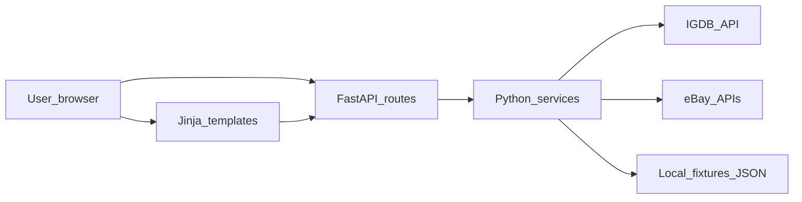

# Game Price Finder (web, Python) — implementation plan

## Context

- Workspace **Game Price Finder Mini Project** was **empty** (greenfield at plan time).
- **Web** delivery and a **hybrid data approach**: **official/API-backed integrations** where practical, plus an **MVP path** using **fixtures and clear placeholders** when a source is blocked, rate-limited, or not yet integrated.
- **Stack**: **Python** with **UV** for pinning, resolution, venvs, and **`uv run`**.

## Product shape (what ships in v1)

- **Primary flow**: prominent **search bar** → **game detail** view.
- **Hero summary**: **median or trimmed-mean** for **new** and **used** (when distinguishable), labeled **estimate** with **data freshness**.
- **Breakdown**: scannable **list/table** of sources (eBay; placeholders for GameStop/others) with **price or range**, **condition**, **link out**.
- **Selling angle**: **recent sold comps** (or p25–p75 band) separate from **current ask** prices.
- **Accessibility & clarity**: large type, contrast, keyboard-friendly search, explicit loading/empty/error states.

## Recommended stack (Python + UV)

| Layer | Choice | Rationale |
|--------|--------|-----------|
| Tooling | **[UV](https://github.com/astral-sh/uv)** | Fast installs, reproducible **`uv.lock`**, **`uv sync`** / **`uv run`**. |
| Python | **3.12.x** (`.python-version`) | Stable baseline; 3.13 optional later. |
| Web framework | **[FastAPI](https://fastapi.tiangolo.com/)** | Async HTTP, OpenAPI, **Pydantic**. |
| HTTP client | **`httpx`** (async) | IGDB/eBay calls. |
| Settings | **`pydantic-settings`** | `.env`, secrets server-side. |
| Templates | **Jinja2** | Server-rendered HTML. |
| Progressive enhancement | **HTMX** (optional) | Partial updates without SPA. |
| CSS | Hand-written **or** Tailwind CLI later | Avoid Node in v1 if desired. |

## Architecture (data flow)

## Project layout (illustrative)

- `pyproject.toml`, `uv.lock`, `.python-version`
- `game_price_finder/` — `main.py`, `services/`, `models.py`, `templates/`, `static/`

## Data sources (v1)

| Need | Practical approach |
|------|--------------------|
| Game search + artwork | **IGDB** (Twitch client id/secret). |
| Marketplace pricing | **eBay** developer APIs (access varies). |
| Retail chains | No stable public API → **placeholders** or fixtures; avoid scraping without acceptance of risk. |

## Configuration

- **`.env`** + **`.env.example`**: Twitch/IGDB, eBay, **`USE_FIXTURES=true`**.

## Milestones

1. Scaffold UV + FastAPI + Jinja + CSS.
2. Routes/services for search + pricing views.
3. IGDB + fixtures.
4. eBay + fixtures.
5. UI polish; optional HTMX.
6. README for keys and limits.

## Out of scope for v1

Accounts, synced watchlists, fee calculators, alerts at scale, scraping catalogs, native apps.
