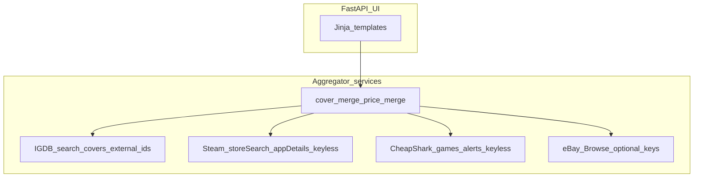

# Covers, broader catalog, multi-source pricing, UI refinement

## Goals

1. **Proper cover art** — larger/normalized artwork and fallbacks when IGDB omits `cover.url`.
2. **Titles like Forza** — reduce misses from narrow IGDB queries / low limits / fixture-only catalogs.
3. **More reputable sources** — **mixed mode**: **keyless Steam + CheapShark** layered on **optional Twitch→IGDB + eBay**.
4. **Cleaner copy + visuals** — typography, methodology prose, cards/tables/spacing.

## Current baseline (why gaps happen)

- IGDB uses `search "term"` with **`limit 15`** in [`game_price_finder/services/igdb.py`](../game_price_finder/services/igdb.py); add wildcard merge + higher limit.
- Covers: upgrade `t_thumb` → **`t_cover_big`** or build from `image_id` ([IGDB images](https://api-docs.igdb.com/#images)).
- **`USE_FIXTURES=true`** uses a tiny catalog — **Forza** won’t appear there; live IGDB needs Twitch keys.

## Architecture after changes

## Implementation plan

### A) IGDB ([`game_price_finder/services/igdb.py`](../game_price_finder/services/igdb.py))

- Raise **limit** (e.g. 30); merge **search** + **`where name ~ *term*`**; dedupe by `id`.
- Fields: **`cover.image_id`**, **`external_games`** (Steam UID).
- **`cover_url_best_effort(...)`**: resize IGDB URLs or construct from `image_id`.

### B) Steam (new [`game_price_finder/services/steam.py`](../game_price_finder/services/steam.py))

- Keyless **store search** + **appdetails** → `header_image`, `price_overview`.
- Guarded matching only when confident (exact title or IGDB Steam UID).

### C) CheapShark (new [`game_price_finder/services/cheapshark.py`](../game_price_finder/services/cheapshark.py))

- `/api/games` + deals endpoints → **`SourceOffer`** / optional **`PriceEstimate`** with digital/deal disclaimers.

### D) Merge ([`game_price_finder/services/pricing.py`](../game_price_finder/services/pricing.py), [`game_price_finder/main.py`](../game_price_finder/main.py))

- **`assemble_game_page(...)`** merging eBay, CheapShark, Steam; clearer **`methodology_notes`**.

### E) Models ([`game_price_finder/models.py`](../game_price_finder/models.py))

- Optional `steam_app_id`, `cover_sources[]` on **`GameSummary`**.

### F) Fixtures + UX ([`game_price_finder/fixture_catalog.py`](../game_price_finder/fixture_catalog.py), templates)

- Clear **demo catalog** messaging; optional fixture with remote cover URL.

### G) UI ([`game_price_finder/static/styles.css`](../game_price_finder/static/styles.css), [`game_price_finder/templates/`](../game_price_finder/templates/))

- Type scale, **prose** utilities, table/card polish; structured HTML for notes.

### H) Docs ([`README.md`](../README.md), [`.env.example`](../.env.example))

- Mixed sourcing matrix; honest limits (PC/digital vs console resale).

## Acceptance checks

- **`Forza`** in live IGDB mode returns multiple hits (not capped at 15).
- Large covers + Steam fallback when matched.
- CheapShark rows visible; eBay optional.
- Methodology reads cleanly.
