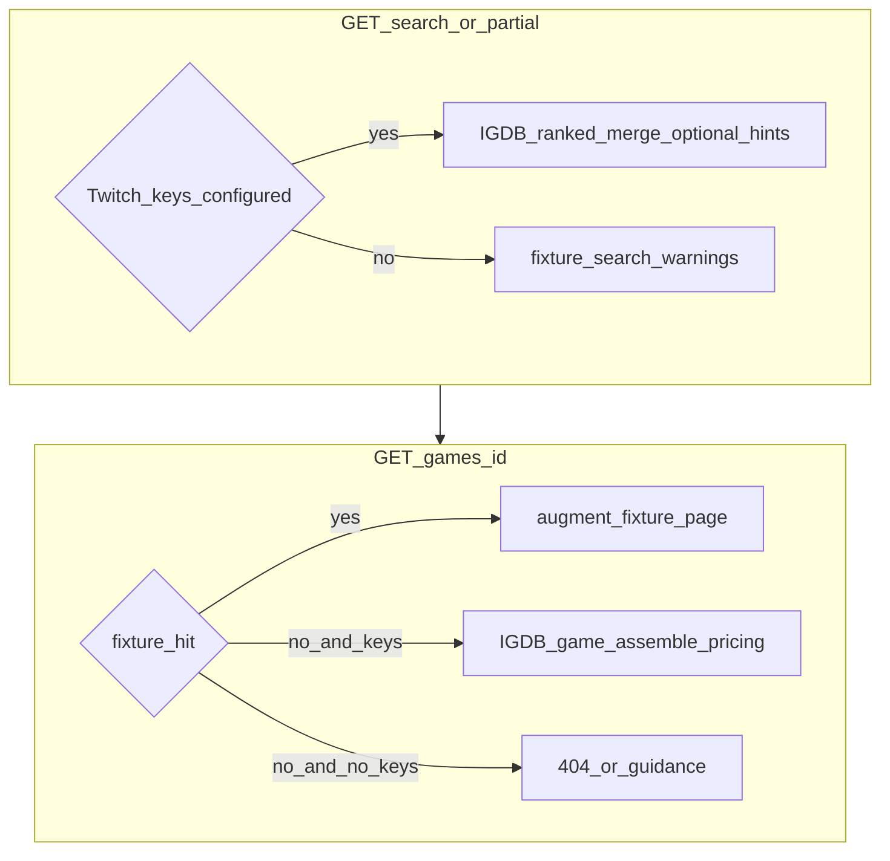

# Franchise search, fuzzy hints, visible pricing, HTMX suggestions

## Root causes (why “Zelda” shows nothing today)

1. **`USE_FIXTURES=true` gates search entirely to fixtures** in [`game_price_finder/main.py`](../game_price_finder/main.py) (`search_page`): [`fixture_search`](../game_price_finder/fixture_catalog.py) only matches substrings against [`demo_fixtures.json`](../game_price_finder/demo_fixtures.json) titles — none contain “Zelda”.
2. **Placeholder copy on the home page is misleading** ([`game_price_finder/templates/index.html`](../game_price_finder/templates/index.html)): it suggests trying “Zelda” in fixture mode.
3. **Detail route blocks real catalog IDs when fixtures are on**: if `use_fixtures` and `fixture_detail` misses, the app **404s** instead of loading IGDB ([`game_detail`](../game_price_finder/main.py) lines 108–111) — so even a fixed search would break after clicking a Zelda hit unless we add a fallback.

## Target behavior

## Implementation plan

### 1) Split “fixture demo” vs “catalog search” semantics

**Search (`/search` + HTMX partial):**

- If **`TWITCH_CLIENT_ID` / `TWITCH_CLIENT_SECRET`** are set → **always call IGDB** via [`search_games`](../game_price_finder/services/igdb.py) (possibly renamed/wrapped), regardless of `USE_FIXTURES`.
- Else → keep **`fixture_search`** only and show a clear banner that franchise search needs Twitch credentials.

**Detail (`/games/{igdb_id}`):**

- If `fixture_detail(id)` exists → current augmented fixture path.
- Else if Twitch keys exist → **fall through to the existing live IGDB + `assemble_game_page` path** (same as today’s non-fixture branch).
- Else → 404 / short HTML error explaining missing credentials.

Document the revised meaning of `USE_FIXTURES` in [`README.md`](../README.md) and tighten banner copy in [`game_price_finder/templates/base.html`](../game_price_finder/templates/base.html).

### 2) Ranked franchise-style ordering (post-submit list)

Extend IGDB layer ([`game_price_finder/services/igdb.py`](../game_price_finder/services/igdb.py)):

- Include **`rating_count`** (and optionally **`first_release_date`**) in `_game_fields_line()`.
- After merging FTS hits (`search "..."`) + wildcard hits (`where name ~ *...*`), **preserve FTS ordering first**, then append wildcard-only IDs **sorted by `rating_count` descending** as a pragmatic “popular franchise entries rise” heuristic when the query is broad (e.g. Zelda).

Expose a single helper e.g. `search_games_ranked(...)` used by both HTML and partial routes.

### 3) Misspelling / “Did you mean”

- Add **`rapidfuzz`** (`uv add rapidfuzz`) for lightweight fuzzy ranking.
- When IGDB returns **fewer than N** results (e.g. `N=3`) **or** zero results:
  - Pull candidate titles from **Steam Store Search** ([`steam_store_search`](../game_price_finder/services/steam.py)) using the same query.
  - Compute **`extractOne` / `process.extract`** suggestions above a configurable ratio threshold.
- Pass `suggestions: list[{title, suggested_query}]` into [`search.html`](../game_price_finder/templates/search.html) / partial template as a dismissible panel (“Did you mean …”) linking back to `/search?q=...`.

Keep suggestions **conservative** (threshold ~70+) to avoid nonsense replacements.

### 4) Show prices on the search grid (hints)

Goal: user sees **some** pricing signal before opening detail.

- After building `games: list[GameSummary]`, asynchronously fetch **CheapShark `cheapest`** for rows that already have **`steam_app_id`** (from IGDB external games).
  - Prefer CheapShark **`GET /api/games`** by **`steamAppID`** when known (bounded concurrency, e.g. semaphore of 8, overall timeout cap).
- Build `price_hints: dict[int, float | None]` keyed by **`igdb_id`** and render on each card in [`search.html`](../game_price_finder/templates/search.html) as a muted line like **“PC deal floor ≈ $12.49 (CheapShark)”** when present; omit when unknown (console-only SKUs won’t have Steam IDs).

Detail pages already assemble fuller pricing via [`assemble_game_page`](../game_price_finder/services/pricing.py); this step fixes “nothing visible” primarily at **search + routing**, plus reinforces expectation copy.

### 5) HTMX live suggestions (debounced)

- Load HTMX from CDN in [`base.html`](../game_price_finder/templates/base.html) (pinned minor version).
- Add **`GET /partials/search-suggestions`** returning **HTML fragment only** (no full layout): reuse the same ranking service as `/search`, cap **`limit=8`**, skip heavy CheapShark hints here to protect rate limits (optional: reuse hints only when ≤3 results).
- Wire **home + search page** inputs with `hx-get`, `hx-trigger="input changed delay:350ms, search"`, `hx-target`, `hx-indicator`, and `hx-request` headers for small partial responses.
- Add minimal styles in [`styles.css`](../game_price_finder/static/styles.css) for a compact suggestion list (keyboard focus states, hover).

### 6) Template / copy fixes

- Update [`index.html`](../game_price_finder/templates/index.html) placeholder and tips so **“Zelda / franchise search” requires Twitch keys** (fixtures remain for offline demo rows).

## Files to touch (expected)

- [`game_price_finder/main.py`](../game_price_finder/main.py) — search branching, detail fallback, new partial route  
- [`game_price_finder/services/igdb.py`](../game_price_finder/services/igdb.py) — ranking fields + ordering helper  
- [`game_price_finder/services/cheapshark.py`](../game_price_finder/services/cheapshark.py) — small helper(s) for `cheapest` by Steam app id batch  
- New small module e.g. [`game_price_finder/services/search_hints.py`](../game_price_finder/services/search_hints.py) — fuzzy + optional batch price hints (keeps `main.py` thin)  
- [`game_price_finder/templates/base.html`](../game_price_finder/templates/base.html), [`index.html`](../game_price_finder/templates/index.html), [`search.html`](../game_price_finder/templates/search.html), new `partials/search_suggestions.html`  
- [`game_price_finder/static/styles.css`](../game_price_finder/static/styles.css)  
- [`pyproject.toml`](../pyproject.toml) / lockfile via `uv add rapidfuzz`  
- [`README.md`](../README.md)

## Acceptance checks

- With Twitch keys configured and `USE_FIXTURES=true`, searching **Zelda** returns **many clickable titles** ordered sensibly (FTS first, popular wildcard fill-ins).
- Clicking a result opens a **priced** detail page (no 404 solely because fixtures lack that id).
- With a deliberate typo (`Zlda`), UI offers **actionable suggestions** when data supports it.
- With **no** Twitch keys, search remains fixture-limited but messaging is honest; home page no longer promises Zelda in fixture-only mode.
- HTMX dropdown shows suggestions while typing (debounced) without obvious jank.
