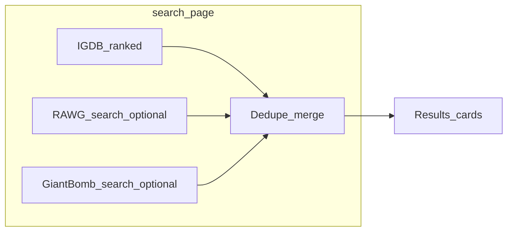

# Supplemental free APIs + SQLite suggestion feedback

## Context from your answers

- **APIs:** Free tiers only; **optional env vars** for keys you register (not paywalled products).
- **Suggestions:** Persist to **SQLite** on the server.

Current catalog flows through IGDB ([`main.py`](game_price_finder\main.py) `search_page`) into [`GameSummary`](game_price_finder\models.py), which today **requires** `igdb_id`. Detail pages use **`/games/{igdb_id}`** ([`main.py`](game_price_finder\main.py), [`search.html`](game_price_finder\templates\search.html)). CheapShark hints key off **`igdb_id`** ([`search_hints.py`](game_price_finder\services\search_hints.py)).

## Part A — Supplemental game APIs (free tier)

### Recommended providers

| API | Key | Role |
|-----|-----|------|
| **[RAWG](https://rawg.io/apidocs)** | Free `RAWG_API_KEY` | Broad PC/console catalog search + game detail (stores links often expose Steam/Epic URLs). |
| **[Giant Bomb](https://www.giantbomb.com/api/documentation)** | Free daily-limited `GIANT_BOMB_API_KEY` | Supplementary search hits + metadata when RAWG/IGDB miss niche titles. |

Both remain **optional**: if keys unset, skip that provider (no behavior regression).

### Integration shape

1. **Settings** ([`config.py`](game_price_finder\config.py)): add optional `rawg_api_key`, `giant_bomb_api_key`; document in [`.env.example`](.env.example), [README.md](README.md), [DEPLOY.md](DEPLOY.md).

2. **New modules** (thin HTTP wrappers):
   - [`game_price_finder/services/rawg.py`](game_price_finder\services\rawg.py) — `search_games(term, limit)`, `get_game(rawg_id)`; parse Steam `app_id` from `stores` when present.
   - [`game_price_finder/services/giantbomb.py`](game_price_finder\services\giantbomb.py) — `search_games(term, limit)` returning minimal rows + Giant Bomb `id`/`guid` for detail fetch.

3. **Unified catalog row for search UI** — extend [`GameSummary`](game_price_finder\models.py) **or** introduce `CatalogHit` with:
   - `title`, cover, release year, optional `steam_app_id`
   - **Exactly one** stable detail discriminator: `detail_kind: Literal["igdb","rawg","giantbomb"]` + matching id fields (`igdb_id` optional; `rawg_id` optional; `giant_bomb_guid` optional).
   - Migration path: keep `GameSummary` as the IGDB-native shape and map RAWG/GB rows **into** it where possible (`igdb_id` filled when IGDB returned the row); supplemental-only rows carry `igdb_id=None` **only if** templates/routes stop assuming non-null — therefore prefer **`detail_url`** string computed server-side (`/games/123` vs `/games/rawg/456` vs `/games/giantbomb/{guid}`) to avoid brittle Jinja branching.

   **Concrete recommendation:** Add optional fields `detail_kind` + ids; add **`detail_path: str`** always set when building the merged list so [`search.html`](game_price_finder\templates\search.html) uses `href="{{ game.detail_path }}"` instead of `url_for(..., igdb_id=...)`. IGDB-only rows continue to populate `igdb_id` for CheapShark hints.

4. **Merge/dedupe** — new helper e.g. [`game_price_finder/services/catalog_merge.py`](game_price_finder\services\catalog_merge.py):
   - Run IGDB first (existing [`search_games_ranked`](game_price_finder\services\igdb.py)).
   - Fetch RAWG (+ Giant Bomb if key present) with bounded limits (respect rate caps).
   - **Dedupe**: drop supplemental rows whose normalized title matches an IGDB hit **or** shares the same `steam_app_id`.
   - Append remainder capped so total list stays reasonable (e.g. max 40).

5. **Detail routes**
   - Keep [`game_detail`](game_price_finder\main.py) for IGDB/fixtures as-is.
   - Add **`GET /games/rawg/{rawg_id}`** and **`GET /games/giantbomb/{guid}`**: fetch provider detail → build [`GameSummary`](game_price_finder\models.py) suitable for [`assemble_game_page`](game_price_finder\services\pricing.py) / Steam lookup / CheapShark (reuse [`resolve_steam_lookup`](game_price_finder\services\steam.py) when `steam_app_id` known).

6. **CheapShark hints on merged grid**
   - Extend hint batching so rows keyed by **`steam_app_id`** still get hints even without IGDB id (either widen [`batch_price_hints_for_games`](game_price_finder\services\search_hints.py) return type to `dict[str, float]` with stable keys like `igdb:{id}` / `steam:{id}`, or parallel `steam_price_hints` dict). Template picks hint using same key helper.

7. **Docs**: README/USAGE/DEPLOY — register RAWG/Giant Bomb keys; note daily limits (Giant Bomb).

## Part B — User suggestions (SQLite)

### Behavior

- Public **`GET /feedback`** — simple form: category (price correction / wrong game data / feature / other), optional game title / IGDB or Steam URL text fields, optional suggested numeric price, free-text notes, optional contact email (never required).
- **`POST /feedback`** — validate lengths (spam caps), insert row, redirect to thank-you page.
- **`GET /feedback/admin`** — last N submissions HTML table (newest first), gated by **`FEEDBACK_ADMIN_TOKEN`** query param or `Authorization: Bearer …` header match env secret (no user accounts).

### Implementation

1. **SQLite path**: env `FEEDBACK_DB_PATH` default `data/feedback.db`; ensure [`gitignore`](.gitignore) ignores `data/` or `*.db`.

2. **Small persistence layer** [`game_price_finder/feedback_store.py`](game_price_finder\feedback_store.py): stdlib `sqlite3`, create table + indexes on `created_at`; thread/process safe enough for single-worker uvicorn (document multi-worker caveat).

3. **Templates**: `feedback.html`, `feedback_thanks.html`; link from [`base.html`](game_price_finder\templates\base.html) nav + optional inline link on [`game.html`](game_price_finder\templates\game.html) footer (“Suggest a correction”) pre-filled hidden fields via query params optional stretch goal.

4. **Security hygiene**: honeypot field + max body lengths; optional IP-based rate limit later (out of scope unless you want [`slowapi`](https://github.com/laurentS/slowapi) added).

## Acceptance checks

- With **only Twitch** configured: behavior matches today (plus dedupe leaves IGDB ordering intact).
- With **RAWG_API_KEY**: queries return extra distinct titles when RAWG finds matches IGDB missed; RAWG-only rows open working detail pages with Steam/CheapShark where parseable.
- **Feedback** submissions persist across restarts; admin URL with wrong token returns 404 or 403.

## Out of scope (unless you expand later)

- Paid APIs (PriceCharting partner tiers, etc.).
- Moderation workflow beyond listing rows.
- Multi-instance SQLite writes without WAL/docs warning.
