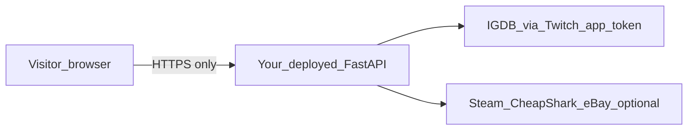

# Zero-download, zero–end-user-login experience

## Clarification (what is blocking today vs what you want)

Your app **does not ask visitors to log in** to Twitch, eBay, or anything else. [`Settings`](game_price_finder\config.py) reads **`TWITCH_*`** / **`EBAY_*`** from **server-side** `.env` (or host env vars). Those are **developer/application** credentials bound to **your deployed backend**, not per-user accounts.

What often feels like “I need to sign in / configure something” is actually:

1. **Running locally** — users must install UV/Python and maintain `.env`; that’s a **developer** path, not an end-user path.
2. **Missing Twitch keys on the server** — without them, catalog search falls back to **fixtures only** (narrow list), which feels broken compared to Plan 01’s IGDB-backed search ([`main.py`](game_price_finder\main.py) `search_page`).
3. **Price hints on search cards** — CheapShark hints only appear when IGDB exposes a **`steam_app_id`**; many titles won’t show a row hint even when detail pricing exists elsewhere.

So your goal—“open website, search, get prices and Plan 01-style breakdown **without download or sign-in**”—maps to **hosted deployment + secrets on the host**, not to removing backends.

## What is possible without visitor friction

| Requirement | Approach |
|-------------|----------|
| No download for visitors | Deploy the app (e.g. Render, Fly.io, Railway, Azure App Service). They only open a URL. |
| No visitor sign-in | Keep current design: no OAuth for users; tokens obtained server-side from Twitch/eBay **application** credentials. |
| Plan 01 features (search, detail, estimates, sources, fixtures when APIs fail) | Same codebase; ensure **production env** has Twitch + optional eBay keys and sane defaults (`USE_FIXTURES`, etc.). |

**Security constraint:** Twitch **Client Secret** (and eBay secrets) must **never** ship to the browser or public repos—only injected as **platform secrets** on the host.

## What you cannot do (without changing product/API choices)

- **Full IGDB catalog in a purely static front-end** with no secret—IGDB access requires a confidential client credential flow suitable for servers.
- **Guarantee** rich pricing on **every** title without upstream APIs (Steam/CheapShark skew PC; console resale may stay thin unless you add more sources).

## Recommended implementation path (minimal code change)

1. **Deploy** the existing FastAPI app behind HTTPS.
2. In the host dashboard, set **`TWITCH_CLIENT_ID`**, **`TWITCH_CLIENT_SECRET`**, and optionally **`EBAY_CLIENT_ID`** / **`EBAY_CLIENT_SECRET`** (same names as [.env.example](.env.example)).
3. Set **`USE_FIXTURES`** as you prefer for messaging (e.g. `false` on public demo so banners match “live catalog”).
4. **Document** in [README.md](README.md) / [USAGE.md](USAGE.md) a short **“For visitors”** vs **“For developers running locally”** split so expectations are clear.

Optional small doc artifact: **`DEPLOY.md`** with one chosen provider’s steps + required env vars list (no secrets).

## Optional larger change (only if you insist “works with zero operator Twitch keys”)

Add a **secondary catalog path**: when Twitch keys are absent, drive search primarily from **[`steam_store_search`](game_price_finder\services\steam.py)** + CheapShark title lookup, synthesizing pseudo–`GameSummary` rows (no IGDB id or synthetic ids). That improves “something shows up” without registration but **diverges** from Plan 01’s IGDB-normalized model and needs careful UX (edition disambiguation, detail page identity).

---

**Bottom line:** Your stated outcome **is achievable** for real visitors by **hosting** the app and putting **application** API credentials on the server—visitors neither download tooling nor sign in. Local `.env` friction disappears once they use the deployed URL.
