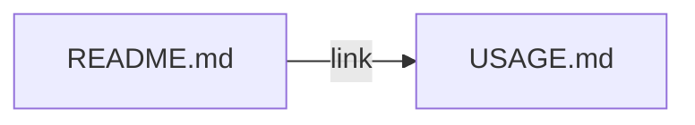

# User manual + plans index update

## 1. User manual content (new file)

**Recommendation:** Add a dedicated **[`USAGE.md`](USAGE.md)** at the repo root (keeps [README.md](README.md) focused on contributors/integrations while the manual stays scannable for “how do I run this?”).

**`USAGE.md` should include:**

- **What it is** — 2–4 sentences in plain language: web UI to search games, see rough price signals (Steam, CheapShark, optional eBay), open a detail page with sources/notes; fixture mode for demos vs live catalog with Twitch/IGDB.
- **How to run** — Same essential steps as README today: `uv sync`, copy `.env.example` → `.env`, `uv run uvicorn game_price_finder.main:app --reload --host 127.0.0.1 --port 8000`, open `http://127.0.0.1:8000`. Point to README for prerequisites (UV, Python 3.12+).
- **How to use the app** — Bullets only: Home search / Search page; fixture-only behavior without Twitch keys vs full IGDB when `TWITCH_CLIENT_ID` / `TWITCH_CLIENT_SECRET` are set; live suggestions (HTMX) when keys exist; result cards with optional CheapShark hint; clicking a row opens `/games/{id}`; demo fixture URLs if `USE_FIXTURES=true`; `GET /healthz` for a quick probe.
- **Configuration at a glance** — One short paragraph + link to README “Live integrations” / `.env.example` for exact variable names (no need to duplicate the full table).

**README change:** After the opening paragraph (or right under the title), add a single line such as *“For a short user guide (run + use the UI), see [USAGE.md](USAGE.md).”* Optionally trim overlapping prose so “Quick start” stays a one-screen pointer to USAGE + one copy-paste block, or leave Quick start as-is and treat USAGE as the expanded narrative—your choice during implementation for minimal duplication.

## 2. Plans folder: add missing plan + index

**Current state:** [plans/README.md](plans\README.md) lists only:

- [01-game-price-finder-python-uv.plan.md](plans\01-game-price-finder-python-uv.plan.md)
- [02-covers-apis-ui-polish.plan.md](plans\02-covers-apis-ui-polish.plan.md)

**Missing from the index:** The **franchise search / fuzzy hints / pricing hints / HTMX** work (referenced in chat as `search_franchise_fuzzy_prices_*.plan.md` under Cursor’s `.cursor/plans`).

**Actions:**

1. **Add a numbered snapshot** in-repo, e.g. [`plans/03-search-franchise-fuzzy-prices.plan.md`](plans\03-search-franchise-fuzzy-prices.plan.md), by copying the latest content from `C:\Users\Admin\.cursor\plans\search_franchise_fuzzy_prices_*.plan.md` (or the authoritative version you keep) into that file—matching the process already described under “Syncing from Cursor” in [plans/README.md](plans\README.md).
2. **Update the index table** in [plans/README.md](plans\README.md) with a third row summarizing plan 03 (IGDB+routing when Twitch keys exist, ranked search, fuzzy suggestions, CheapShark hints on grid, HTMX partial, copy/README alignment).
3. **Root README “Project plans”** — Optionally add one line listing all three numbered files by name so readers don’t have to open `plans/README.md` first (or keep a single link to `plans/README.md` if you prefer less churn).

## 3. Out of scope

- Do **not** edit the original file under `.cursor/plans` (repo convention is copy-into-`plans/`).
- No app code or template changes unless you discover a doc/URL mismatch while writing USAGE (fix only if clearly wrong).

## 4. Quick verification

- Open `USAGE.md` and follow it on a clean machine mentally: commands run, URLs correct, behavior matches [main.py](game_price_finder\main.py) routes (`/`, `/search`, `/partials/search-suggestions`, `/games/{igdb_id}`, `/healthz`).
- Confirm `plans/README.md` links resolve and `03` file is present.
