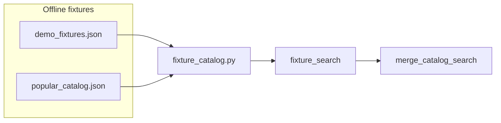

# Expand offline fixtures + configurable catalog limits

## Constraints (why we do it this way)

- **Synthetic IDs only** for bundled pages: [`fixture_detail`](game_price_finder/main.py) wins over live IGDB when an ID matches. Real IGDB IDs must **not** appear in fixture JSON, or detail pages would serve stale bundled data instead of IGDB ([`game_detail`](game_price_finder/main.py) lines 280–283).
- **No IGDB/Steam bulk redistribution**: titles/release years/platforms are factual; avoid copying proprietary descriptions or scraping IGDB dumps. Covers: prefer `null`, permissive Wikimedia URLs where appropriate, or omit—matching current pattern where [`demo_fixtures.json`](game_price_finder/demo_fixtures.json) already uses one Steam CDN header as demo art.
- **Pricing stays illustrative**: keep explicit disclaimers on estimates/sources/sold bands like existing demos (`Demo fixture — illustrative only.` / methodology notes).

## Part 1 — Configurable live-search caps

Add numeric settings (with sane defaults) in [`game_price_finder/config.py`](game_price_finder/config.py), documented in [`.env.example`](.env.example) and briefly in [`USAGE.md`](USAGE.md):

| Setting | Purpose | Default suggestion |
|---------|---------|-------------------|
| `catalog_merge_max_results` | Final slice after merge | `40` (current [`MAX_MERGED_RESULTS`](game_price_finder/services/catalog_merge.py)) |
| `igdb_search_limit` | `search_games_ranked(..., limit=...)` on full `/search` | `30` (current implicit default in [`igdb.py`](game_price_finder/services/igdb.py)) |
| `catalog_rawg_limit` / `catalog_gb_limit` | Passed into [`merge_catalog_search`](game_price_finder/services/catalog_merge.py) | `15` / `8` |

Implementation notes:

- Replace module-level constant use in [`main.py`](game_price_finder/main.py) with `settings.catalog_merge_max_results` when slicing merged lists (both branches at ~177 and ~226).
- Change [`merge_catalog_search`](game_price_finder/services/catalog_merge.py) to accept `merge_max: int` (or read settings only from callers—prefer explicit parameter from `main` to keep the merge module free of settings coupling).
- Optionally tune HTMX partial [`search_suggestions_partial`](game_price_finder/main.py): either proportionally smaller limits derived from the same settings or dedicated `*_partial_*` env vars if you want dropdowns to stay short while full search grows.

## Part 2 — Larger offline bundle (fixtures)

**Loader:** Extend [`fixture_catalog.py`](game_price_finder/fixture_catalog.py) so `_catalog_pages()` concatenates entries from:

1. Existing [`demo_fixtures.json`](game_price_finder/demo_fixtures.json) (keep current 900001–900003 demos if desired).
2. New file e.g. [`game_price_finder/popular_catalog.json`](game_price_finder/popular_catalog.json) with the same schema: `{ "entries": [ GamePricingPage, ... ] }`.

Use **non-overlapping synthetic `igdb_id` block**, e.g. **910001 upward**, documented in comments/USAGE so operators never assign real IGDB IDs there.

**fixture_search:** Today [`fixture_search`](game_price_finder/fixture_catalog.py) defaults `limit=20`; [`main.py`](game_price_finder/main.py) never passes a higher limit, so empty-query browsing truncates early. Wire `fixture_search(q, limit=settings.catalog_merge_max_results)` (or a dedicated `fixture_search_limit` setting defaulting to `catalog_merge_max_results`) when running under fixtures.

**Content strategy for “as many as possible” within repo sanity:**

- Target **on the order of 100–200** entries in v1 (adjust for JSON size ~200–400 KB).
- Each entry: accurate **title**, **release_year**, **platform_summary** (publicly documented facts); optional short **methodology_notes** line citing “curated factual catalog metadata”; **cover_image_url** mostly `null` unless you use clearly permissible URLs.
- Reuse one **small Python or script generator** under `scripts/` that reads a maintained CSV (`title,year,platforms,igdb_id`) and emits valid `GamePricingPage` skeleton JSON with shared boilerplate estimates/sources/disclaimer strings—so expanding later does not require hand-editing giant JSON.

## Part 3 — Docs

- [`USAGE.md`](USAGE.md): explain new env vars; clarify offline bundle is factual catalog metadata + illustrative economics only.
- [`README.md`](README.md): one sentence pointing deployers at fixture expansion vs raising API limits.

## Verification

- With `USE_FIXTURES=true`, empty `/search` lists merged fixture slice up to configured limit; substring search finds many titles from `popular_catalog.json`.
- With Twitch + RAWG + GB keys, raising limits increases row count until APIs/de-duplication plateau (still capped by `catalog_merge_max_results`).
- Spot-check `/games/910001` (example) renders fixture page; real IGDB ID still loads live when not in fixtures.
