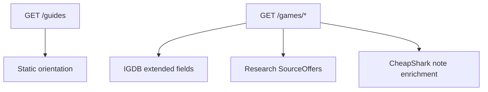

# Buyer / seller information features

## Goals

Improve **orientation** for people evaluating purchases or listings: clearer signals (what each number means), **research shortcuts** (sold vs active comps, editions, technical/game context), and **checklists** that reduce costly mistakes—without turning the app into a marketplace.

## Current baseline

- Detail UI ([`game_price_finder/templates/game.html`](game_price_finder/templates/game.html)): estimates, sold band, sources table, methodology list, feedback deep-link.
- Pricing assembly ([`game_price_finder/services/pricing.py`](game_price_finder/services/pricing.py)): eBay Browse asks + bands, Steam snapshot, CheapShark deals (up to 8), placeholder GameStop/Amazon/PriceCharting searches.

## 1) Guides hub (`/guides`)

- Add [`game_price_finder/templates/guides.html`](game_price_finder/templates/guides.html) with two sections **For buyers** and **For sellers**: short bullets on interpreting asks vs comps, verifying edition/platform/region, using sold listings, photos/authenticity, fees/shipping caveats—all framed as “verify externally.”
- Wire [`game_price_finder/main.py`](game_price_finder/main.py) route `GET /guides`.
- Add nav link in [`game_price_finder/templates/base.html`](game_price_finder/templates/base.html).
- One paragraph in [`USAGE.md`](USAGE.md) pointing to `/guides`.

## 2) IGDB-backed catalog context on live detail pages

Extend IGDB game queries so live [`GameSummary`](game_price_finder/models.py) carries optional metadata (no change required for RAWG/Giant Bomb routes unless trivial passthrough):

- Add optional fields on `GameSummary`, e.g. `genres`, `game_modes`, `short_description` (truncate server-side ~400 chars), `igdb_slug` (for stable outbound URL).
- Update [`game_price_finder/services/igdb.py`](game_price_finder/services/igdb.py) `_game_fields_line()` / `_game_summary_from_payload()` to request `genres.name`, `game_modes.name`, `summary`, `slug` (same expansion pattern as existing `platforms.name`).
- Render a compact **About this title** panel on [`game.html`](game_price_finder/templates/game.html) when any of those fields exist (fixture pages may omit).

Outbound: `https://www.igdb.com/games/{slug}` when slug present.

## 3) Research links row (buyers + sellers)

Centralize URL builders (small helper module under [`game_price_finder/services/`](game_price_finder/services/), or functions colocated in `pricing.py`) used by live assembly **and** optionally by fixture augmentation notes:

| Link | Audience | Purpose |
|------|----------|---------|
| eBay **sold / completed** search (`LH_Complete=1`, `LH_Sold=1`) | Buyers/sellers | Historical comps orientation ([existing manual hub uses active-style search](game_price_finder/services/pricing.py) today—keep both distinct rows/labels). |
| **SteamDB** `https://steamdb.info/app/{steam_app_id}/` | Buyers/sellers | Bundles/editions/update history orientation when Steam ID known. |

Inject as additional [`SourceOffer`](game_price_finder/models.py) rows (consistent with existing table) or as a dedicated sub-list—prefer extending sources table with clear labels (“Sold listings hub”, “Steam edition/bundle reference”) to avoid duplicating layout.

## 4) CheapShark-derived buyer signals (lightweight)

CheapShark deal payloads commonly expose **`metacriticScore`**, **`steamRatingText`**, **`steamRatingPercent`**, **`normalPrice`/`salePrice`/`savings`** ([already partially used via `deal_price_usd`](game_price_finder/services/cheapshark.py)).

- After fetching deals in [`cheapshark_market_section`](game_price_finder/services/pricing.py), derive a short **aggregate line** for methodology notes (e.g. best-known Metacritic among scanned deals, Steam user-review summary if present, typical discount %) — **only when fields are non-empty**, no extra HTTP calls.
- Optionally surface **normal vs sale** on the existing deal rows via `SourceOffer` label suffix or separate columns only if template/CSS stay readable (minimal change: enrich `label`).

## 5) Static buyer/seller checklists on detail pages

Add two collapsible `
` blocks on [`game.html`](game_price_finder/templates/game.html) with concise bullets:

- **Buyer**: confirm SKU/edition (GOTY/Deluxe), region, physical vs digital, key resale risks, compare sold comps—not just lowest ask.
- **Seller**: disclose condition/edition, compare **sold** comps for pricing anchors, photo/traceability expectations—still “information only.”

Keep copy in the template (or a tiny included partial) so lawyers/product owners can tune wording without Python churn.

## 6) Styles

Append scoped rules to [`game_price_finder/static/styles.css`](game_price_finder/static/styles.css) for guides layout, checklist panels, and optional stats chip row so new sections match existing palette/light-dark behavior.

## Verification

- Live IGDB detail shows genres/modes/summary/slug link when Twitch credentials configured.
- Sources table lists distinct **active** vs **sold/completed** eBay hubs; SteamDB appears when `steam_app_id` set.
- `/guides` reachable from nav; fixture-only pages still render checklists + remain usable without IGDB fields.
