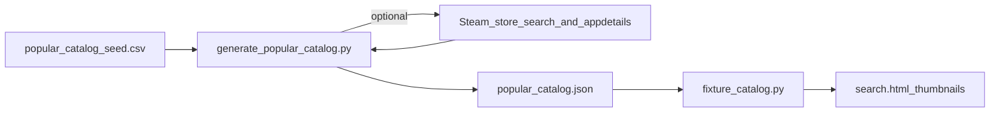

# Proper cover / title art for fixture games

## Problem

- [`popular_catalog.json`](game_price_finder/popular_catalog.json) entries set `"cover_image_url": null` ([`scripts/generate_popular_catalog.py`](scripts/generate_popular_catalog.py)).
- [`search_page`](game_price_finder/main.py) renders fixture rows straight from [`fixture_search`](game_price_finder/fixture_catalog.py) with **no** [`resolve_steam_lookup`](game_price_finder/services/steam.py) pass, so cards stay placeholder thumbnails even though detail views often get art via [`apply_steam_cover_fallback`](game_price_finder/services/steam.py) after augment.

## Approach (recommended)

**Offline enrichment when regenerating fixtures**: after building each `GamePricingPage` dict, optionally resolve Steam header image + app id using the **same** matching rules as the live app.

### Implementation

1. **Extend the generator CLI** ([`scripts/generate_popular_catalog.py`](scripts/generate_popular_catalog.py)):
   - Add flag e.g. `--enrich-steam-covers` (default off for fast/no-network runs).
   - When enabled, after CSV rows load, run an async pipeline:
     - For each title: build `GameSummary(title=..., steam_app_id=None)` (plus optional platform suffix in title **only if** you add CSV overrides later—initially title-only matches existing Steam behavior).
     - Call existing `resolve_steam_lookup(game)` from [`steam.py`](game_price_finder/services/steam.py).
     - If `steam` exists and `steam.header_image`, apply **confidence gate** (default **`high` only** to avoid wrong artwork on ambiguous names like remasters with identical tokens); optional `--steam-cover-confidence medium` for broader coverage at higher mismatch risk.
     - Write into fixture JSON: `cover_image_url`, `steam_app_id`, and `cover_sources: ["steam:header"]` (model already supports these fields per [`models.py`](game_price_finder/models.py)).
   - Concurrency: bounded semaphore (e.g. 4–6) + small delay optional to stay polite to Steam JSON endpoints.
   - Rows with no confident Steam hit remain `null` (console-only exclusives may need manual CSV overrides).

2. **Optional CSV overrides** (same file [`scripts/popular_catalog_seed.csv`](scripts/popular_catalog_seed.csv)):
   - Add optional columns `steam_app_id` and/or `cover_image_url`. When present, skip Steam search or skip fetch if URL provided—fixes edge cases without codifying brittle title searches.

3. **Regenerate artifact**: Run once with network:

   `uv run python scripts/generate_popular_catalog.py --enrich-steam-covers`

   Commit updated [`popular_catalog.json`](game_price_finder/popular_catalog.json).

4. **Demo fixtures** ([`demo_fixtures.json`](game_price_finder/demo_fixtures.json)): either add explicit Steam header URLs / app ids for the two titles missing art, or run a tiny one-off enrichment for those rows only—minimal manual edit is acceptable for three demos.

5. **Documentation**: Short note in [`USAGE.md`](USAGE.md) under fixture/catalog section: bundled covers may come from **Steam Store API** (`steamcdn` headers); regenerate script requires network when `--enrich-steam-covers` is used.

## Why not only runtime enrichment?

Fetching Steam for dozens of fixture rows on every `/search` would add latency and duplicate traffic; baking URLs keeps fixture mode fast and aligns thumbnails with detail behavior.

## Optional later enhancement (out of scope unless you ask)

- Second-pass enrichment using **RAWG** (`background_image`) when `RAWG_API_KEY` is set and Steam misses—helps Nintendo-heavy exclusives.

## Verification

- With `USE_FIXTURES=true`, `/search` empty query shows thumbnails for Steam-backed titles after regeneration.
- Spot-check a console-exclusive fixture: still acceptable placeholder unless CSV override added.
- Detail page unchanged or improved when `steam_app_id` now present on fixture rows (CheapShark hints may improve).
