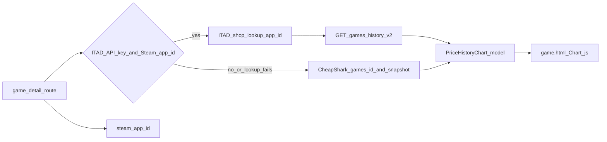

# Price history chart on game detail

## Constraints (why two sources)

- [CheapShark `/games?id=…`](https://www.cheapshark.com/api/1.0/games?id=612) exposes **`cheapestPriceEver`** (single dated milestone) plus current **live deals**. It does **not** return a usable event stream for lifetime curves.
- [IsThereAnyDeal **`get/games/history/v2`**](https://docs.isthereanydeal.com/) returns a chronological log of storefront price-change events `{ timestamp, shop, deal.price.amount, currency }`, which fits a multi-point chart. Access requires **[registering an app and API key](https://isthereanydeal.com/apps/my/)**.
- User choice: **prefer ITAD when configured; otherwise CheapShark fallback**.

## Data model ([`game_price_finder/models.py`](game_price_finder/models.py))

Introduce compact Pydantic types attached to **`GamePricingPage`** (additive field, default `None`):

- **`PriceHistoryPoint`**: ISO `datetime`, `price` (float), `currency`, short `caption` / `series_key` for tooltips.
- **`PriceHistoryDataset`**: `key`, `display_name`, `points` (sorted ascending by time).
- **`PriceHistoryChart`**: human-readable **`title`** + **`footnote`**/caveats array, **`source`** enum (`isthereanydeal` | `cheapshark`), **`datasets`** (ITAD supports one line per **shop**, e.g. Steam vs others).

**Disclaimer copy** baked into chart footnotes (matching page tone elsewhere): digitals Steam/key deals vs discs; CheapShark/ITAD are **tracked storefront signals**, not a complete economic “lifetime”; ITAD keyed on **Steam `app/` id**, so consoles-only titles may degrade to CheapShark or show “insufficient trace” messaging.

## Backend services

### 1) IsThereAnyDeal ([`game_price_finder/services/isthereanydeal.py`](game_price_finder/services/isthereanydeal.py) — new)

- **`Settings`**: add optional **`itad_api_key: str | None = None`** in [`game_price_finder/config.py`](game_price_finder/config.py).
- Use **official base URL / auth header** exactly as documented in ITAD OpenAPI/security (implementers should copy from the docs portal rather than guessing; tests can mock endpoints).
- **Resolve ITAD UUID** via shop lookup (**Steam shop id consistently shows as `61` in ITAD examples** — confirm once against `/lookup/id/shop/61/v1` with payload `["app/<steam_app_id>"]`; handle `subs`/`bundles` only if lookup returns variants).
- **`GET …/games/history/v2`**: supply `id=<uuid>`, `country=US` (align with app’s **`default_currency` / storefront bias** pass `country=\"US\"` unless you intentionally align with IGDB locale later), **`since`** set to release year‑anchored cutoff (fallback 10+ years ago) because docs state **defaults only load ~last 3 months** without `since`.
- Parse response → group events by `shop.id` into separate **`PriceHistoryDataset`** lines for Chart.js multi-series.
- **Guardrails**: cap datasets (e.g. top N shops by event count) and/or cap points (downsample chronologically if ITAD sends huge payloads) to keep SSR HTML small and UI responsive.

### 2) CheapShark augmentation ([`game_price_finder/services/cheapshark.py`](game_price_finder/services/cheapshark.py))

- Add **`cheapshark_fetch_game_bundle(cheapshark_game_id: int) -> dict`**: `GET {CHEAPSHARK_BASE}/games?id=…`, reuse existing client/header patterns.
- **Fallback chart builder**: points from **`cheapestPriceEver`** (+ optional **“best current tracked deal price” now** pulled from deals list / existing `cheapshark_deals_for_game`).
- Consolidate duplication: refactor **`fetch_cheapshark_snapshot`** to call the new bundle fetch once resolved so `pricing.py` and history share one detail payload (avoids doubling HTTP traffic).

### 3) Assembly ([`game_price_finder/services/pricing.py`](game_price_finder/services/pricing.py) + [`game_price_finder/main.py`](game_price_finder/main.py))

- Add **`async def build_price_history_chart(game, steam_lookup, settings) -> PriceHistoryChart | None`** (new module acceptable if circular imports appear between `pricing` and ITAD helpers).
  - Try ITAD pipeline when **`settings.itad_api_key`** and **`game.steam_app_id`** are present.
  - On failure OR missing prerequisites → CheapShark milestones using resolved CheapShark id (reuse search/pick flow).
- Thread result into **`assemble_game_page(..., price_history=…)`** or assign on the page object before templating (`page.model_copy(update={...})` in **`_assemble_live_detail`** and mirrored in **`augment_fixture_page`** so fixture+demo layouts stay consistent).

## Frontend ([`game_price_finder/templates/game.html`](game_price_finder/templates/game.html), [`game_price_finder/templates/base.html`](game_price_finder/templates/base.html), [`game_price_finder/static/styles.css`](game_price_finder/static/styles.css))

- Mirror existing asset pattern (**CDN + defer** alongside htmx in [`base.html`](game_price_finder/templates/base.html)): add **Chart.js** UMD bundle.
- Insert a **`Price history`** `<section class="panel">` on the detail page containing:
  - **`<canvas height="260">`** with deterministic `id`.
  - **`<noscript>`** or **tabular fallback** rendering the same milestones for accessibility.
  - **`<script type="application/json" id="…">`** embedding server-serialised chart payloads (prefer `{{ chart.model_dump_json()|safe }}` or explicit Jinja escaping strategy used elsewhere).
- Initialise chart in a small **`DOMContentLoaded` IIFE**: **category X-axis sorted date labels** (`labels` + aligned `datasets[i].data` arrays) avoids pulling `chartjs-adapter-*` deps.
  - ITAD dataset: stacked legend with shop colours (derive from hashing shop id→**CSS-safe HSL**, keep consistent with monochrome site via muted palette tweak).
  - CheapShark: **2-point line** labelled “All‑time tracked low vs today’s scanned floor”; large footnote stating sparseness.

## Edge cases / product behaviour

- **No CheapShark mapping + no Steam + no ITAD**: hide panel or brief “No storefront history aggregated” message tied to observable reasons.
- **ITAD resolves but Steam history empty**: gracefully fall through to CheapShark if possible else empty state.

## Verification (manual)

1. Detail page with **`ITAD_API_KEY`**, known Steam blockbuster (heavy history expected): multi-point chart renders, legend distinguishes shops.
2. Same page without key but CheapShark hit: milestone chart renders with disclaimers.
3. Console‑only IGDB titles lacking Steam linkage: explanatory empty/milestone state matches reality.
